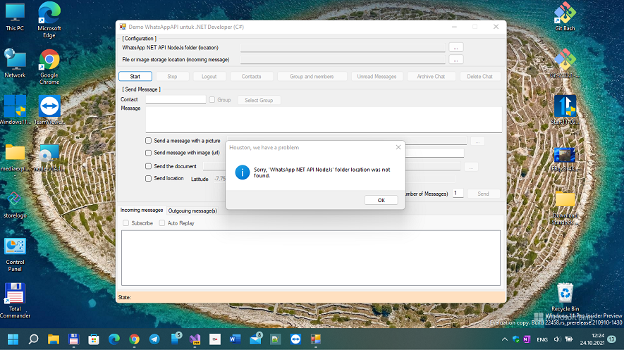

# WhatsApp Client , WinForm edition (for .NET Developers)

Fork (Replica) of https://github.com/WhatsAppNETClient/WhatsAppNETClient2/

## About

This is a special WhatsApp Desktop Client demo app for .NET Developers.
This thing is built on the [whatsapp-web.js](https://github.com/pedroslopez/whatsapp-web.js/) 
engine to facilitate communication with the WhatsApp Web application.

## My 2 cents
* English translation of app UI
* Project extension scheme

## Screenshots

## Project extension scheme
 
* Add some "integration bus" (OneDrive spec. folder, like a WhatsApp?) to WA Desktop client
* Make some UWP Assistent app (for WinMobile) for WA Desktop client remote controlling... ;) 

## Release Info and Installation Instructions

You can read more tech. details at http://wa-net.coding4ever.net/
(Please use Google Translator))

## System Requirements

* Windows 10, 11 and latest version windows (Windows 365 as Server, he-he?)
* .NET Framework 4.5 and .NET latest version
* Node.js version 14.16.x or later
* [Software git](https://git-scm.com/downloads) (version control)

## My "Workbench" 

Visual Studio 2022 Preview 4

Xamarin workbench

UNO Platform extesion

and... NodeJS installed =)

## Features

* Full mode * stealth * (headless / no window). You can say goodbye to the chrome/firefox browser which usually 
  appears to run WhatsApp Web.
* Automatically saves login sessions (so scan the WA qr code just once)
* Now supports the use of *single* WA account (no Multi-account/multi-device support yet, sorry!)
* Grab contacts to read WA contacts so that the results can be saved to the database
* Grab groups and members to read group data and its members so that the results can also be saved to the database
* Send personal or group messages
* Send multiple messages (broadcast)
* Send messages with images, audio, video and all kinds of documents
* Send messages with images, audio, video and all kinds of documents via URL
* Send location
* ReplyMessage (quoted message)
* Can store images, audio, video, all types of documents including vcards from incoming messages 
  (you can specify the storage location yourself)
* Can also read messages of type `vcard` and `location`
* Can read messages from groups and get sender information
* Subscribe to ChangeState events to monitor connection status changes
* Subscribe to incoming messages, so you don't need to add another timer object to read incoming messages
* Subscribe to messages sent, with this feature we can check whether the message sent was successful or failed
* Archive chat
* Delete chat
*Logout
* Can be easily integrated with all types of databases

## Reporting a Bug or Error

Technically in the development of an application is clearly impossible to be 100% free of bugs. 
So if you find a bug or error when using the WhatsApp NET Client, 
please report it on the https://github.com/WhatsAppNETClient/WhatsAppNETClient2/issues page

## Solution Layout
Projects have a DOCs which expands on the internal functionality and layout of that project... it's good for your own R.E. 
There are no DOCs which explains all architecture, API, OneDrive integration bus yet... this is just beginning... =)

# Contribute!
There's still a TON of things missing from this proof-of-concept (MVP) and areas of improvement 
which I just haven't had the time to get to yet.
- UI Improvements (for GTK, for example, or for each one of supported mutli-platforms)))
- Additional Language Packages
- Media Transferring Support: screenshots, etc. (for the brave)

With best wishes,

  [m][e] 2021

## Thanks!
I wanted to put down some thank you's here for folks/projects/websites that were invaluable for helping me get this project into a functional state:
- [KR Software](https://github.com/WhatsAppNETClient) - "WA .NET Platform" developer
- [WhatsAppNETClient2](https://github.com/WhatsAppNETClient/WhatsAppNETClient2/) - Original WA Client demo app

## License & Copyright

WAClientWinForms 1.0.0.0 is RnD project only. AS-IS. No support. Distributed under the MIT License.  